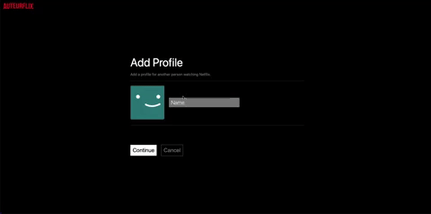
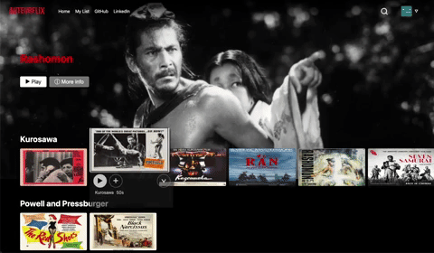
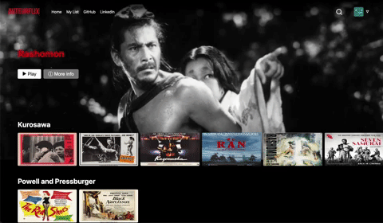
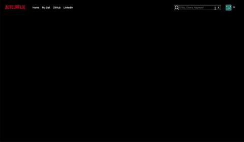

___

AuteurFlix is a Netflix-style streaming UI built around the work of acclaimed
auteur directors — Kurosawa, Kubrick, Bergman, Fellini, Bong Joon-ho, Powell &
Pressburger, and more. The interface mirrors modern Netflix (autoplay hero,
edge-anchored row hover, expanding details modal) while surfacing
director-first metadata throughout. It was built with:

* Backend: Rails 7 (API mode for `/api/*`)
* Database: PostgreSQL
* Frontend: React 18 + Redux Toolkit (TypeScript)
* Styling: SCSS (Sprockets / SassC)
* Bundler: Webpack 5
* Hosting: Render (free tier)
* External data: TMDB (ratings, vote counts, posters)
* Languages: Ruby, TypeScript, SCSS, HTML

Check out the site [here](https://auteurflix-0vvx.onrender.com/#/browse).

> **Note:** This app is hosted on Render's free tier, so it may take 30–60 seconds to load on the first visit while the server spins up. 

## MVP Features
### 1. Profiles
As with Netflix, a  AuteurFlix user can create, edit, and delete profiles, allowing multiple people to share a single 'account' and curate their individual My Lists.



### 2. Browse
After signing in and choosing a profile, the user lands on the main browse
page. The page leads with a **featured-auteur hero** that crossfades from a
poster image into a muted trailer (with a sound toggle), and shows the
director, year, runtime, and TMDB rating beside the title. Below the hero,
films are arranged in horizontal rows whose categories are themselves
director-named ("Kurosawa", "Powell and Pressburger", "Fellini") or
era/style-named.

Each row uses an **edge-anchored hover scale** so the first and last cards in
a row never clip off-screen. Hovering a card autoplays its trailer in the
thumbnail and reveals title, director, year, and a play / add-to-list /
expand control set. Clicking the expand control opens the **details modal** —
crossfading hero video, director-led subtitle, full summary, an "About"
aside (director, genres, year), and two recommendation grids: **More from
{director}** and **More like this**.



The carousel uses a horizontally-scrolling flex container with native scroll
snap; arrows fade in on row hover and animate the scroll position by ~85% of
the row width per click:

```ts
const scroll = (direction: 'left' | 'right') => {
  const el = sliderRef.current;
  if (!el) return;
  const scrollAmount = el.clientWidth * 0.85;
  el.scrollBy({
    left: direction === 'left' ? -scrollAmount : scrollAmount,
    behavior: 'smooth',
  });
};
```

### 3. My List
Each profile has a unique My List to help the user keep track of movies they'd like to watch. They can add or delete a given movie from the main browse page or a separate My List page. 



### 4. Search
The header search input matches against **title, director, summary, and
genre** as the user types. Director matching is the auteur-specific addition:
typing "Kurosawa" surfaces every film by Kurosawa in the catalog. Match sets
are merged and de-duplicated before render:

```ts
const movieSet = new Set(movieMatches.flat().concat(genreMatches.flat()));
const displayMovies = Array.from(movieSet);
const header = searchString.length > 0 && displayMovies.length === 0
  ? `Your search for '${searchString}' did not have any matches.`
  : '';
```



## Roadmap

Implementation status of the auteur-centric overhaul.

**Completed**
- Featured-auteur hero with image→video crossfade, sound toggle, and
  director / year / runtime / rating subtitle
- Edge-anchored card hover with row peek (~7 cards visible at desktop)
- Director label on every card and modal
- Modal split recommendation rails ("More from {director}" + "More like
  this") with a director-aware "About" aside
- Scroll-aware header (transparent over hero, solid after scroll) with SVG
  search and chevron icons
- Director matching in header search
- My List empty state
- Removed legacy class-component scroll math, dead `top-sound-off` CSS, and
  unused `display`/`soundOff` modal props

**Next up**
- Director landing page (`/director/:slug`) with portrait, bio, and
  filmography — clickable from cards, modal, and hero
- "Top 10" numbered row driven by TMDB rating × vote count
- Continue Watching row backed by playback progress
- National-cinema browse axis (Japan, Italy, France, etc.)
- Replace Rails-injected `window.logoURL` / `window.avatar` globals with
  webpack asset imports


